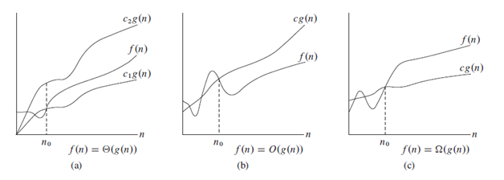
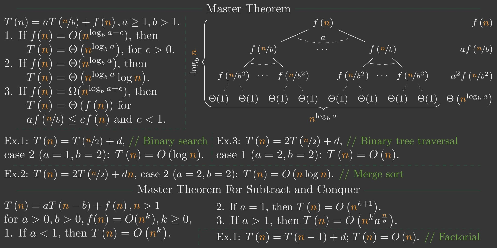

# Algorithms in Python
### What is an algorithm?
An algorithm is a procedure that consists of a finite set of instructions which, given input from some set of possible inputs, enables to obtain an output.
>Donald Knuth: “**Computer Science is the Study of Algorithms.**”

#### Starting Example 1: Insertion Sort
Insertion sort is a simple sorting algorithm that works similar to the way you sort playing cards in your hands. The array is virtually split into a sorted and an unsorted part. Values from the unsorted part are picked and placed at the correct position in the sorted part.

**Note**: Finding the right place of the picked element is another algorithm, we have to find its place by comparing and shifting till finding its correct place. I noted it here because I remember while for the first time I learned about algorithms, especially sorting one, always I was thinking so high level and because of that, I was thinking I don’t have a mind to understand or even design algorithms.

I took the following image of how the insertion algorithm works from [Wikipedia](https://en.wikipedia.org/wiki/Insertion_sort#/media/File:Insertion_sort.gif). Also, there are many other websites like [visualgo](https://visualgo.net/en) that visualizes these algorithms and also Data Structures.

You can find the source code of this algorithm in Python [here](01-introduction/01-insertion-sort.py). The complexity of this algorithm is O(n2) because it consists of two nested loops.

#### Starting Example 1: Merge Sort
This sorting algorithm is a divide-and-conquer algorithm, which divides an array into two half arrays, and after sorting them separately, merges them to build the whole array again. The following example is taken from [Wikipedia](https://en.wikipedia.org/wiki/Merge_sort#/media/File:Merge-sort-example-300px.gif).

You can find the source code of this algorithm in Python [here](01-introduction/02-merge-sort.py). The complexity of this algorithm is O(nlogn). The vision of the complexity is that because in each step of this algorithm every array with the length of n is divided into 2 subarrays and so we have a tree of operations with logn height, and also because in each level of the tree we have to merge two subarray requiring a loop iterating on n elements so the algorithm's complexity is (n x logn).

To understand how important complexity is and also to have a sense on how much faster O(nlogn) is than O(n2), an input file with 1M random numbers in input folder is generated, then feeded to the algorithms. Just go and test them and see the execution time difference between them.

***

Asymptotic Analysis
In mathematical analysis, asymptotic analysis, also known as asymptotics, is a method of describing limiting behavior. In analyzing algorithms complexity, we refer to this method to be able to compare algorithms generallym, using O notation generally. You can see some example as follows:

n2 + 5n + 10 = O(n2)

log3(n) = O(log2(n))

log(n!) = log(n * (n -1) * ... * 1) = logn + log(n - 1) + log(n - 2) + ... + log2 + log1 = O(nlogn)

In the following [image](https://www.dotnetlovers.com/article/129/explanation-on-asymptotic-notations), we can see the notations clearly.

**Note**: It is convension to use O instead of teta (scientifically incorrect).

For analyzing recursive algorithms, we can analyze them intuitively by considering a tree and the operations needed on each layer, and just multiply them. But, it is not going to work all the time.

**Master Theorem**: In the following [image](https://www.reddit.com/r/algorithms/comments/bfs1yc/master_theorem_cheat_sheet/), master theorem is shown, which we can easily use to analyze our recursive algorithms. However, we have to be able to write the recursive equation of the recursive algorithm that we want to analyze.

***

#### [Season 1 - Divide and Conquer Algorithms](03-divide-and-conquer/divide-and-conquer.md)

#### [Season 2 - ]()